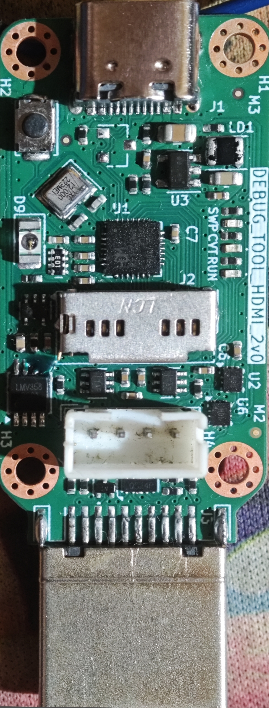
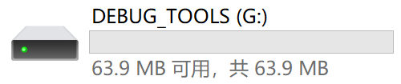
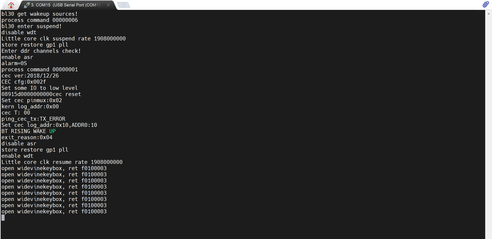
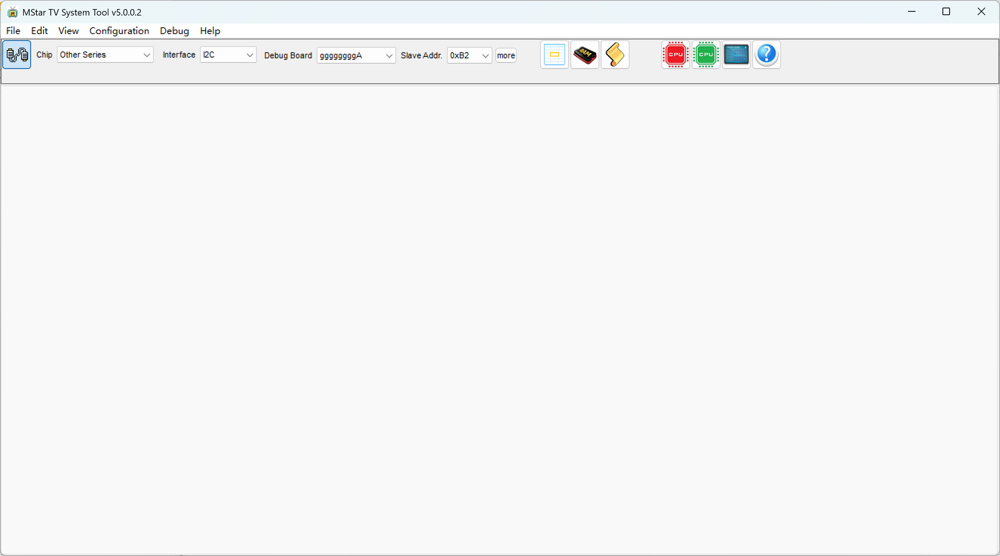
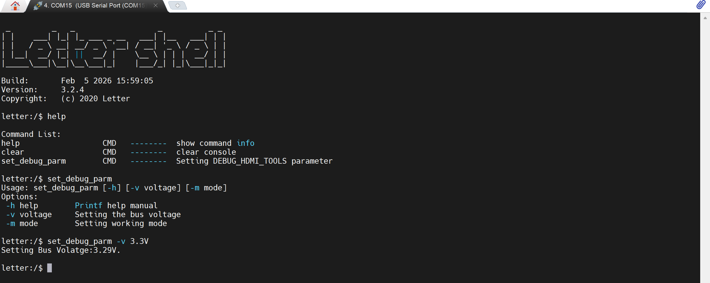

# HDMI Debug Tool

&emsp;&emsp;这是一个基于CHV305FB的电视机串口/I2C调试工具。其核心原理模拟FTDI Vendor设备实现的，大部vendor代码基于libusb ftdi的Vendor请求实现。考虑一些涉密问题，工具只开放了BootLoader的源码，真正的应用程序只能提供编译好的固件。工具烧录好BootLoader后，只要按住按键上电，就可以uf2进行拖拽烧录，对后期固件更新很是友好。

&emsp;&emsp;工具支持公板/TCL/长虹/小米/海尔的串口定义，通过Button切换定义。板载电平转换芯片，可以灵活配置输出电平电压。兼容UART和I2C，可以适用Mstar官方调试工具。

# 按键和指示灯

## 按键

&emsp;&emsp;小板上只有一个按键，Boot和功能切换均需要通过这个按键实现。按下按键上电，小板会进入BootLoader。PC会显示一个U盘设备，将准备好的UF2固件直接拷贝到虚拟U盘，即可实现固件更新。

&emsp;&emsp;在用户程序，按键用于进行功能切换，功能定义见状态指示灯章节。

## 运行指示灯

&emsp;&emsp;丝印RUN对应的LED用于指示小板的运行状态。正常运行时RUN灯闪烁。LED不闪烁，说明小板异常需要断电重启。

## 状态指示灯

&emsp;&emsp;状态指示灯一共有两颗，丝印分别为SWP和CVT，用于指示小板的串口定义模式。

|  SWP灯  |  CVT等  |  功能定义         |
|:-------:|:-------:|:----------------:|
|   灭    |   灭    |  公板/TCL         |
|   亮    |   灭    |  长虹             |
|   灭    |   亮    |  XiaoMi/Hair     |
|   亮    |   亮    |  扩展定义         |

# 测试
## 串口功能测试

&emsp;&emsp;目前我只能测试小米电视，将小板连接到小米电视支持HDMI打印的串口。先按下Button，将功能切换小米电视串口。

## I2C功能测试

&emsp;&emsp;使用Mstar调试测试I2C功能，小板和主板均能正常识别。使用ISP工具烧录固件到TV Board，固件完整烧录，主板正常启动。

# 高级功能

&emsp;&emsp;小板模拟了两个串口，一个Vendor串口，一个是ACM串口。ACM串口能帮用户实现更多操作。

&emsp;&emsp;比如用户程序实现了串口电压的设定，只需根据help提示设置即可。设置后，配置会保存在MCU的Flash中。配置文件存储在Bootloader中，更新固件数据也不会消失。

# 待开发功能

&emsp;&emsp;本人软件水平有限，目前只实现了基本功能。目前硬件功能都验证OK，还有几个扩展的软件功能暂未开发。

- 串口电平自动识别功能
- 红外发射功能
- 小板输出外部使能功能
- 串口日志保存到TFCard